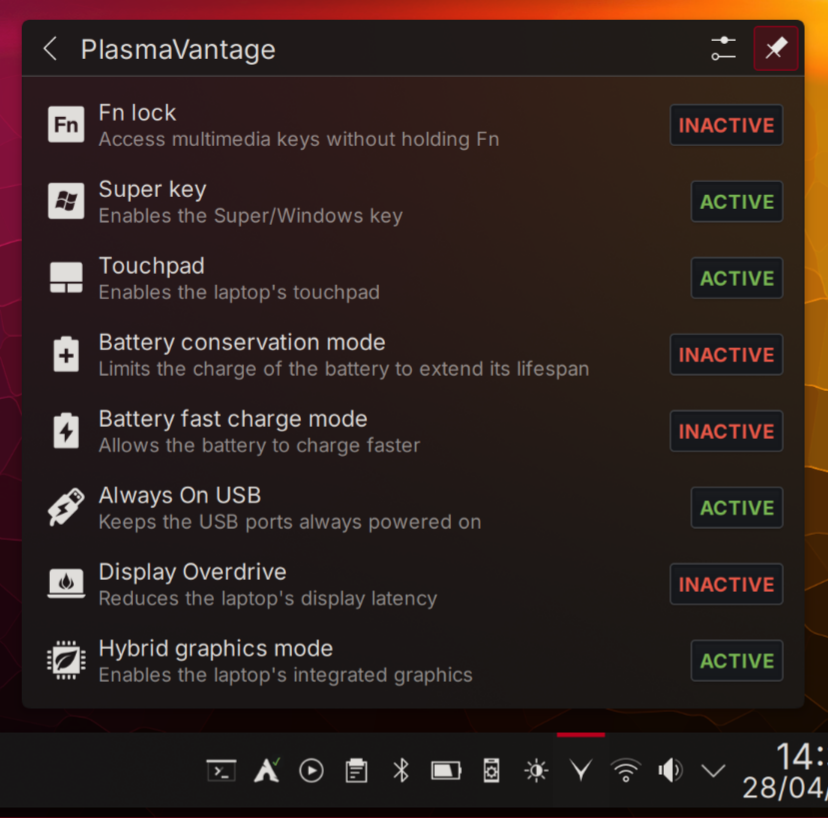

# PlasmaVantage for Plasma 6

This plasmoid allows you to easily control features of your Lenovo Legion or Ideapad laptop series such as battery fast charging, conservation mode, hybrid graphics and more that are exposed by the [LenovoLegionLinux](https://github.com/johnfanv2/LenovoLegionLinux) and Ideapad kernel modules.
This is meant to offer an alternative to the official, proprietary and Windows-only Lenovo Vantage.

## Requirements

- [LenovoLegionLinux](https://github.com/johnfanv2/LenovoLegionLinux) kernel module for:
    - Windows key toggle
    - Touchpad toggle
    - Battery fast charge mode
    - Display overdrive
    - Hybrid GPU mode
- Ideapad kernel module (Included in mainline Linux) for:
    - Fn lock toggle
    - Battery conservation mode
    - Always ON USB charging

## Password-less operation

The plasmoid supports password-less operation however by default sysfs files are only writeable by root. If you don't want to input your password for every change, you have to make the relevant sysfs files writeable by the user.  
A systemd service file is available in `contents/util/plasmavantage-noroot.service` that sets the correct permissions for passwordless operation.  
To manually set this up and for subsequent boots after installing the plasmoid:  
`sudo -E sh -c "cp $HOME/.local/share/plasma/plasmoids/com.gitlab.scias.plasmavantage/contents/util/plasmavantage-noroot.service /etc/systemd/system && systemctl enable --now plasmavantage-noroot.service"`

## Disclaimer

- This is just a hobby project and is **NOT AFFILIATED WITH LENOVO IN ANY WAY**.
- This plasmoid just uses sysfs interfaces provided by LenovoLegionLinux and ideapad modules. Since Lenovo never officially supported these interfaces on Linux, many of them were discovered through reverse engineering and ACPI disassembling.
Therefore, just like LLL or the Linux kernel, **THIS COMES WITH NO WARRANTY AND SHOULD BE USED AT YOUR OWN RISK**.

## Issues

Please open an issue if you can toggle options using legion_gui/_cli but not with this plasmoid.

- The controls state will not refresh if the plasmoid is expanded and the user uses Fn buttons or another tool to switch one of the controls.

## Translations

- [X] French

If you wish to contribute your own, send your `language.po` made from `translate/template.pot` via a merge request or an issue.

## Roadmap / TODO

- [ ] Improve look and feel
- [ ] Customize and rearrange controls
- [ ] Customize plasmoid/tray icon
- [ ] Add an icons-only compact mode
- [X] Show prompt to reboot for settings that need it to apply (v0.21)
- [X] Localisation support (v0.25)
- [X] Password-less operation (v0.20)
- [X] Notifications (v0.22)
- [ ] OSD
- [ ] Requirements checks & better error detection
- [ ] Support Thinkpads and possibly other laptop drivers

## License

Mozilla Public License 2.0.

## Credits

Some of the icons used in this project are derivative work from [SVGRepo](https://www.svgrepo.com).
